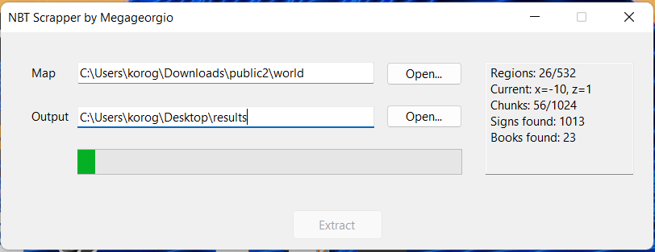

# nbt-scrapper
Extract books and signs from minecraft map, supports 1.18.2

- Requires: [.NET 6 Runtime](https://dotnet.microsoft.com/en-us/download/dotnet/6.0 ".NET 6 Runtime"), Windows 7+
- Based on: [nbt-studio](https://github.com/tryashtar/nbt-studio "nbt-studio")
- Supports: [mc-book-publisher](https://github.com/jarekt/mc-book-publisher "mc-book-publisher")

Code quality is pretty bad but at least it works...